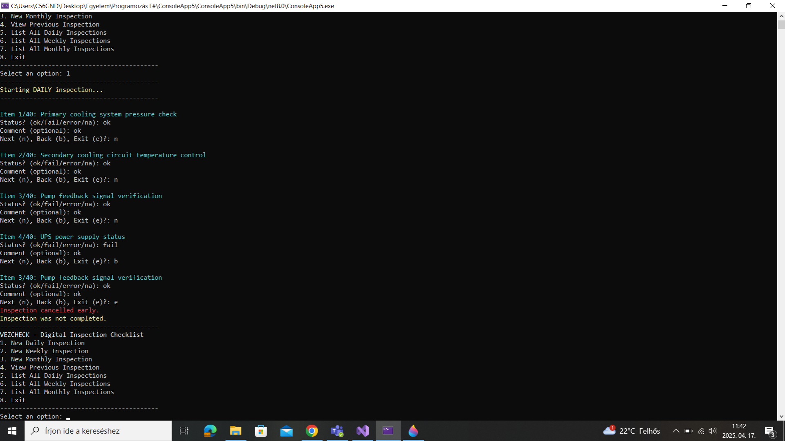

# VezCheck – Digital Checklist Manager

VezCheck is a console checklist app I wrote in F#. It's made for use in nuclear plant control room. It helps the workers to do daily, weekly and monthly checks and save the results.

## Why I made it

Paper checklists are kinda old-school and not easy to track. So this app is for making things easier and more clear. You can see what was done, when, and by who. Also you can see stats and errors.

## Main stuff it does

- Choose daily / weekly / monthly inspection
- Every item can be OK / FAILED / NOT_APPLICABLE
- Saves the data into .json and .csv file
- Shows how many things failed or got comments
- Uses menu with text navigation
- A bit of ASCII decoration and color text
- Future plans: roles for users, alerts, showing equipment status and if something needs maintenance etc.

## Screenshot



## How to use it

You need [.NET 8 SDK](https://dotnet.microsoft.com/en-us/download).
  
Clone this repo, then open the folder with Visual Studio  
or run it from terminal with:

```
dotnet run
```

You can also check your results in the `inspections` folder. It makes files there.

## Try it live

No web version now, it's just a terminal/console app.

## Repo

GitHub: https://github.com/sitkeij84/vezcheck

## Project info

- Name: Jozsef Sitkei  
- Subject: Functional Programming in F#  
- Teacher: Adam Granicz 
- Project: Alpha (midterm)  
- Deadline: 25 April 2024  
- Lines of code: around 300+  

## Maybe later...

- GUI version (graphical interface)  
- Login for users  
- Nice graphs/stats  
- Tag-based filtering  
- More cool stuff if time lets
